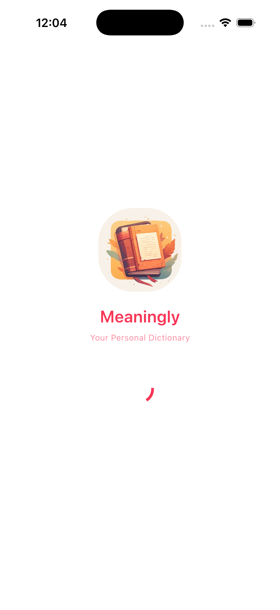
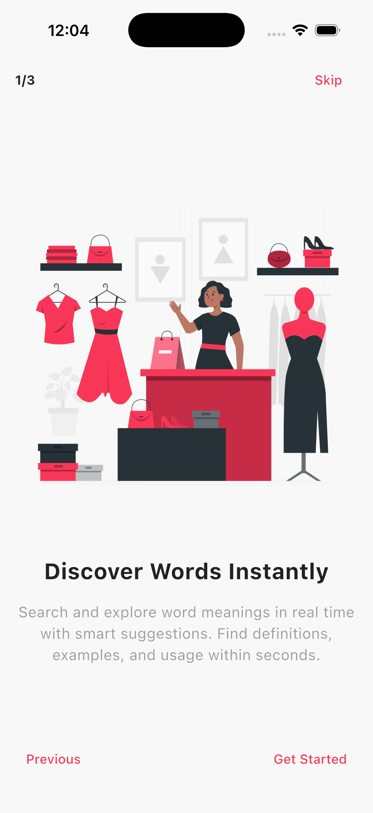
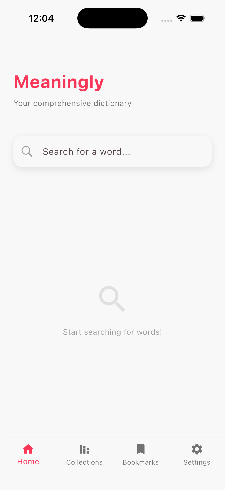
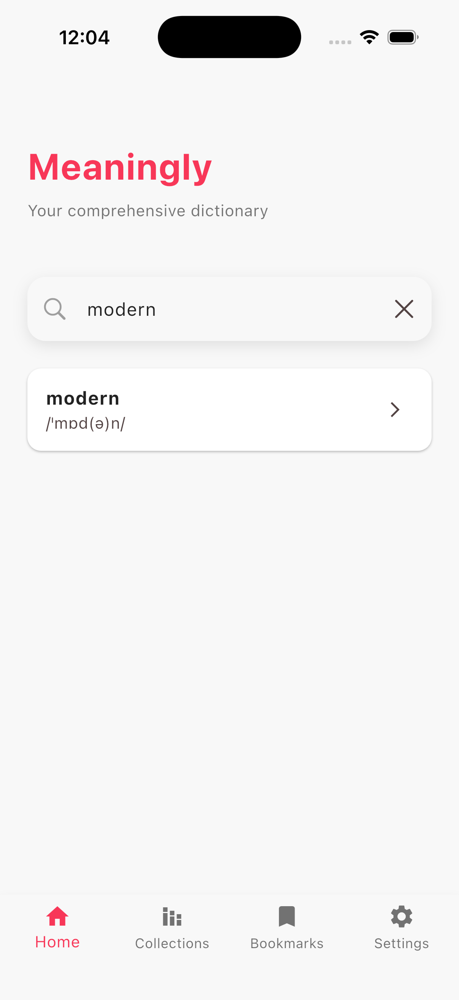
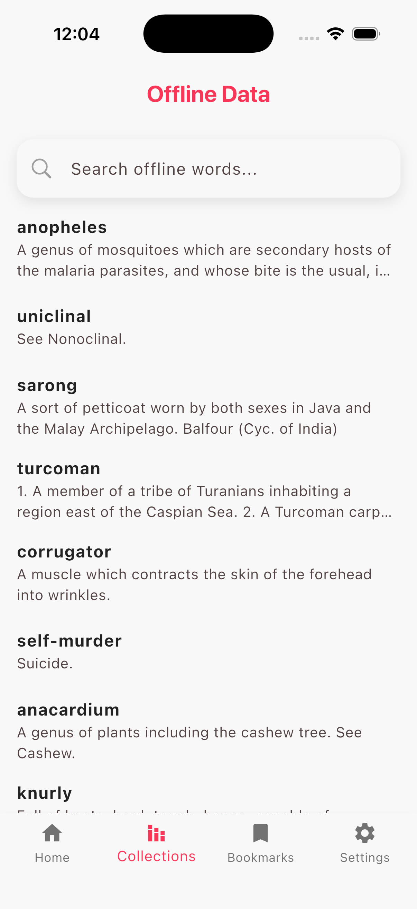
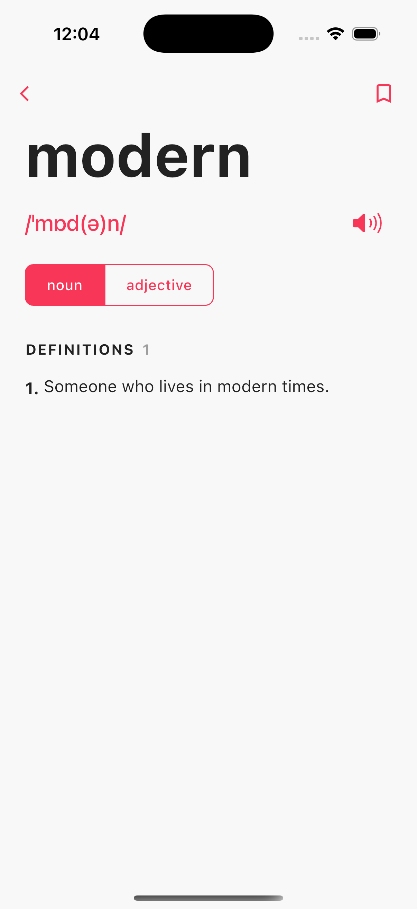
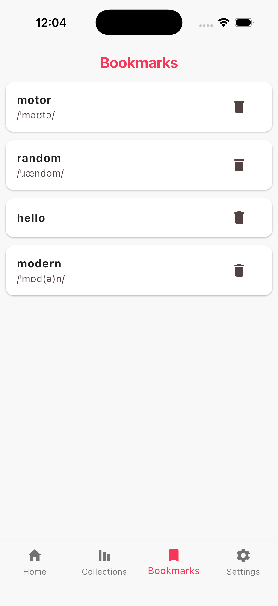
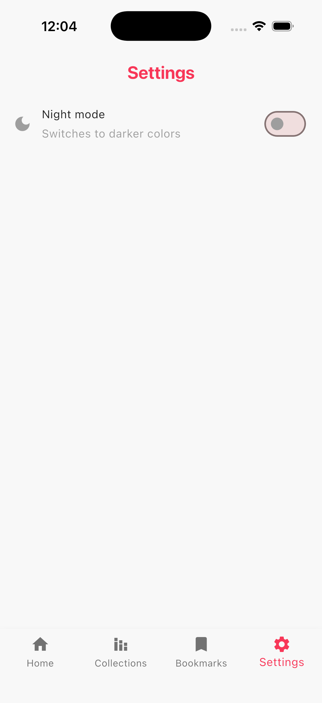
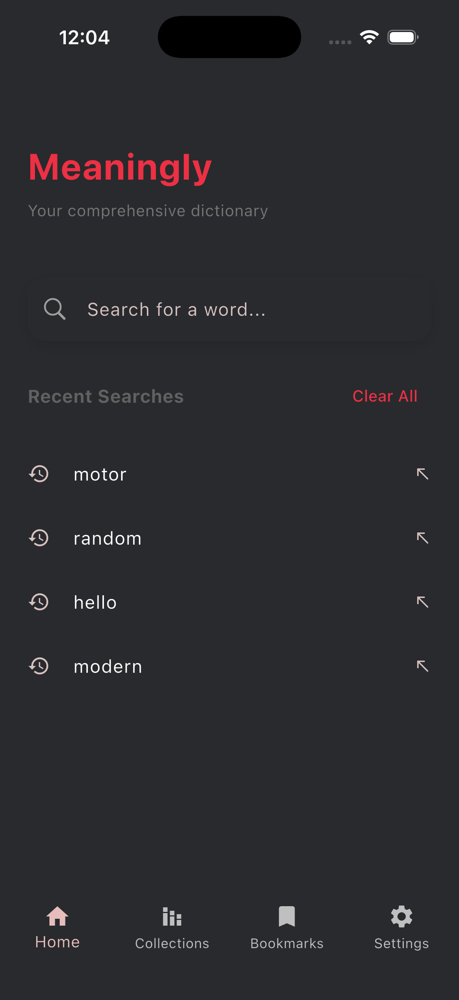

<div align="center">
  

  <h1>Meaningly</h1>

  <p><strong>A fast, reliable dictionary app offering both offline and online capabilities for seamless word discovery anywhere.</strong></p>

</div>


---

## Overview

Meaningly is a comprehensive dictionary application designed to provide reliable word definitions, synonyms, and phonetics whether you have an internet connection or not. It smartly manages data by prioritizing online results when connected and seamlessly falling back to a robust offline database when disconnected, ensuring you always have the definitions you need.

---

## Screenshots

<div align="center">
  
  
  
  
  
  
  
  
  
</div>

---

## Features

### Core Capabilities
- **Offline & Online Dictionary** — Search seamlessly on both online and offline modes. Shows offline data when the internet is not available.
- **Smart Connectivity** — If connection restores, it shows the online data first. Even if online data is not available, it searches the offline database and displays the results.
- **Bookmarks** — Save and manage your favorite words for quick access.
- **Theme Switching** — Easily switch between light and dark themes to match your preference.

### Tech Stack & Dependencies
The application is built using Flutter and relies on the following key packages:
- **go_router** — For declarative routing.
- **riverpod** — For robust state management.
- **chopper** — For handling API requests gracefully.
- **connectivity_plus** — To monitor network state and switch between online/offline modes.
- **audioplayers** — For playing phonetic pronunciations.
- **shared_preferences** — For storing user settings like themes.
- **sqflite** — For reliable offline database storage.

---

## Installation

### Prerequisites
- [Flutter SDK](https://docs.flutter.dev/get-started/install)
- Dart SDK

### Build from Source

1. **Clone the repository**
   ```bash
   git clone git@github.com:zajiim/meaningly.git
   cd meaningly
   ```

2. **Get dependencies**
   ```bash
   flutter pub get
   ```

3. **Run code generation (if required)**
   ```bash
   flutter pub run build_runner build --delete-conflicting-outputs
   ```

4. **Run the app**
   ```bash
   flutter run
   ```